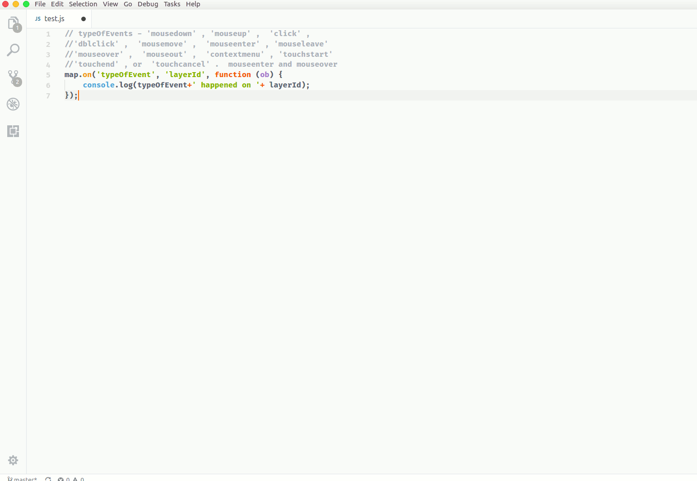

# Mapbox GL JS Javascript TypeScript Snippets for VS Code

**Now Updated for mapbox-gl.js v0.42.2  release**

This extension for Visual Studio Code adds snippets for mapbox-gl.js for TypeScript and JavaScript.

See the [CHANGELOG](CHANGELOG.md) for the latest changes

## Usage

Type part of a snippet, press `enter`, and the snippet unfolds.

### TypeScript javascript Mapbox gl js Snippets

| Snippet                      | Purpose                    |
|------------------------------|----------------------------|
| `mb-new-map`                 | Create new map object      |
| `mb-basic-map`               | Create basic mapbox object |
| `mb-add-source`              | Add Source to map          |
| `mb-on-map-click`            | Add click event to map     |
| `mb-script`                  | Add script to HTML         |
| `mb-geojson-Data`            | Create geojson             |
| `mb-add-layer`               | Add layer to map           |
| `mb-load-img-from-url`       | Load Image from URL        |
| `mb-remove-layer`            | Remove Lauer from Map      |
| `mb-remove-source`           | Remove Source from Map     |
| `mb-remove-image`            | Remove image from Map      |
| `mb-source-loaded`           | Check if Source is loaded  |
| `mb-get-source`              | Get Source object          |
| `mb-add-event-listners`      | Add event on map           |

Alternatively, press `Ctrl`+`Space` (Windows, Linux) or `Cmd`+`Space` (OSX) to activate snippets from within the editor.

## Installation

1. Install Visual Studio Code 1.10.0 or higher
1. Launch Code
1. From the command palette `Ctrl`-`Shift`-`P` (Windows, Linux) or `Cmd`-`Shift`-`P` (OSX)
1. Select `Install Extension`
1. Choose the extension
1. Reload Visual Studio Code
